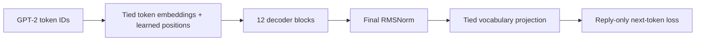

# Six-hour RX 7900 XTX baseline

This GELU/learned-position candidate is preserved for comparison. The user has
selected a separate RoPE + SwiGLU candidate; see [MODERN_BASELINE.md](MODERN_BASELINE.md)
and use `-Profile Modern` for that run. This document describes `-Profile Overnight`.

Experiment: `overnight-124m-v1`. This is a larger from-scratch baseline created
for the user's six-hour overnight budget. The original 16.3M T4 baseline,
its configuration, and completed Colab run remain separate.

## Architecture

Implemented by `configs/overnight_124m.json` using the existing, tested
architecture-version-2 decoder in `mini_deepseek.py`.

| Component | Overnight baseline | Historical T4 baseline |
| --- | --- | --- |
| Parameters | **124,337,664** | 16,275,968 |
| Decoder blocks | **12** | 4 |
| Hidden width | **768** | 256 |
| Attention heads | **12 x 64 dimensions** | 4 x 64 |
| Dense feed-forward | **768 -> 3,072 -> 768, GELU** | 256 -> 1,024 -> 256 |
| Normalization | Pre-RMSNorm + final RMSNorm | Same |
| Attention | Causal multi-head SDPA, padding keys masked | Same |
| Positions / context | Learned absolute / **1,024 tokens** | Same |
| Dropout | **0.1** | Same |
| Tokenizer | Packaged GPT-2, 50,257 tokens | Same |
| Embedding / output | Tied, randomly initialized | Same |
| Gradient checkpointing | **Disabled after GPU profiling** | Enabled |

The shared embedding/output matrix has 38,597,376 parameters (31.0% of this
model). Approximately 85.74M remain for decoder blocks, positions, and norms,
versus about 3.41M in the small baseline. This increases the capacity devoted
to modeling relationships between tokens. There is one reply-only next-token
objective. MoE remains off; the stored auxiliary-loss coefficient has no effect
in the dense configuration.



Each decoder block applies pre-RMSNorm, causal attention, and a residual add,
then pre-RMSNorm, the GELU feed-forward network, and another residual add.
Small embedding initialization and depth-scaled residual projections are
already implemented. The causal mask, EOS convention, and padding behavior
are unchanged and covered by regression tests.

The 12-layer / 768-wide shape follows a conventional small language-model
scale, as exemplified by the [GPT-2 paper](https://cdn.openai.com/better-language-models/language_models_are_unsupervised_multitask_learners.pdf).
This project uses its own RMSNorm-based implementation and random weights;
it does not load GPT-2 pretrained weights or reproduce GPT-2 pretraining.

## Training recipe

| Setting | Value |
| --- | --- |
| Planned epochs | **4** |
| Per-invocation time budget | **6 hours** |
| Micro-batch / accumulation | **8 / 4**, effective batch 32 |
| Precision | **FP16 with gradient scaling**, FP32 master weights |
| Optimizer | AdamW, betas (0.9, 0.95), weight decay 0.01 |
| Peak learning rate | **0.00015** |
| Schedule | 500 warm-up updates, then cosine over four planned epochs |
| Gradient clipping | Global norm 1.0 |
| Seed | 42 |
| Recovery checkpoint | Every 250 successful optimizer updates; keep latest and previous |
| Model selection | Lowest full-validation perplexity after completed epochs |
| Test split | Reserved for final evaluation |

The six-hour limit saves at an optimizer boundary and leaves the original
four-epoch learning-rate schedule intact. Resume can continue the same run
another night. The limit is checked between accumulation groups and around
epoch evaluation; finishing an in-progress validation or checkpoint write
can exceed the nominal six hours. It is not a hard process kill.

If the budget stops a partially completed epoch, `latest.pt` contains the
resumable state and `best.pt` remains the best completed validation result.
The `time_limit.json` file records the most recent budget stop. A manual
interruption instead relies on the last periodic checkpoint. No full run
was launched while preparing this configuration.

## Measured resource budget

Measurements used the actual RX 7900 XTX, packaged training examples up to
1,024 tokens, FP16, effective batch 32, and warm-up before timing.

| Candidate | Examples/sec | Peak allocated | Peak reserved |
| --- | ---: | ---: | ---: |
| Batch 8, checkpointing enabled | 29.77 | 7.72 GiB | 9.65 GiB |
| Batch 16, checkpointing enabled | 28.73 | 13.42 GiB | 15.49 GiB |
| **Batch 8, checkpointing disabled — selected** | **36.28** | **11.25 GiB** | **12.97 GiB** |

The selected candidate processed 1,024 measured examples in 28.23 seconds,
with 32 successful measured updates and no skipped updates. Benchmark weights
were discarded. These measurements establish runtime feasibility, not quality
or a statistically precise speed comparison.

Projected training-only time is **1.36 hours/epoch, 5.44 hours for four epochs**.
The remaining roughly half-hour allows some validation and checkpoint overhead;
the time limit provides recovery if actual throughput is lower. Sustained clock
rates and other applications can change the estimate. The measured reservation
leaves comfortable room below the previously chosen 18–19 GiB training budget.

The actual trainer also passed a 256-example smoke run with eight successful
optimizer updates, no skipped updates, finite gradients/weights/optimizer state,
and verified checkpoint resume and reloaded predictions. Its peak reservation
was **15.28 GiB** (11.24 GiB allocated), higher than the isolated benchmark;
use this larger measured value when planning headroom. This short run validates
execution, not final model quality or sustained overnight memory use.

Evidence:

- `reports/overnight-124m-b8-initial.json`
- `reports/overnight-124m-b16.json`
- `reports/overnight-124m-no-gc-b8.json`
- `reports/overnight-124m-no-gc-config.json` (the selected benchmark config)
- `reports/overnight-tests.log` (28 tests passed)
- `checkpoints/overnight-124m-smoke-20260922/result.json` (real trainer passed)

## Data and interpretation

The unchanged training split contains 177,698 examples, 76,267,633 context
tokens, and **24,570,718 supervised reply tokens per pass**. Four passes expose
the model to 98,282,872 reply-token targets, with the same underlying examples
repeated. They are not 98M unique tokens. Context tokens contribute conditioning
but receive no direct next-token loss in this experiment.

Keep the 768-token context / 256-token reply preparation and thread-level split.
There are 40,966 training replies at the 256-token limit; truncation and the
narrow domain remain limitations. This experiment changes both capacity and
training budget relative to the historical run, so it is not a controlled
architecture-only ablation.

[Compute-optimal training research](https://arxiv.org/abs/2203.15556) emphasizes
balancing model size and training data. Its large-scale pretraining results
do not directly specify an optimum for this conditional roleplay dataset.
The 124M choice is a practical, measured capacity experiment; it does not
guarantee fluent roleplay. Judge the completed model using held-out generations
and validation loss. Preserve the planned pretrained Mistral comparison.

## Commands

From PowerShell in the project folder:

```powershell
# Re-run the short train/resume/reload check:
.\train_amd.ps1 -Profile Overnight -Mode Smoke

# Start a fresh overnight experiment when ready:
.\train_amd.ps1 -Profile Overnight -Mode Train -RunName overnight-124m-v1

# Continue that same experiment with its original settings:
.\train_amd.ps1 -Profile Overnight -Mode Resume -RunName overnight-124m-v1
```

The launcher defaults to `Small` when `-Profile` is omitted. Checkpoints stay
under `checkpoints/<run-name>/`. Keep this PowerShell process running and arrange
for Windows to remain awake; the launcher does not change the PC's power policy.

After training, use `evaluate_generation.py` on this run's `best.pt`, the fixed
50 validation prompts, and generation seeds 42/43/44 as described in
`BASELINE.md`. Report grammar, relevance, coherence, repetition, response length,
and validation perplexity together. The model still has no KV cache, so that
generation panel can take additional time and is outside the six-hour training
budget.
