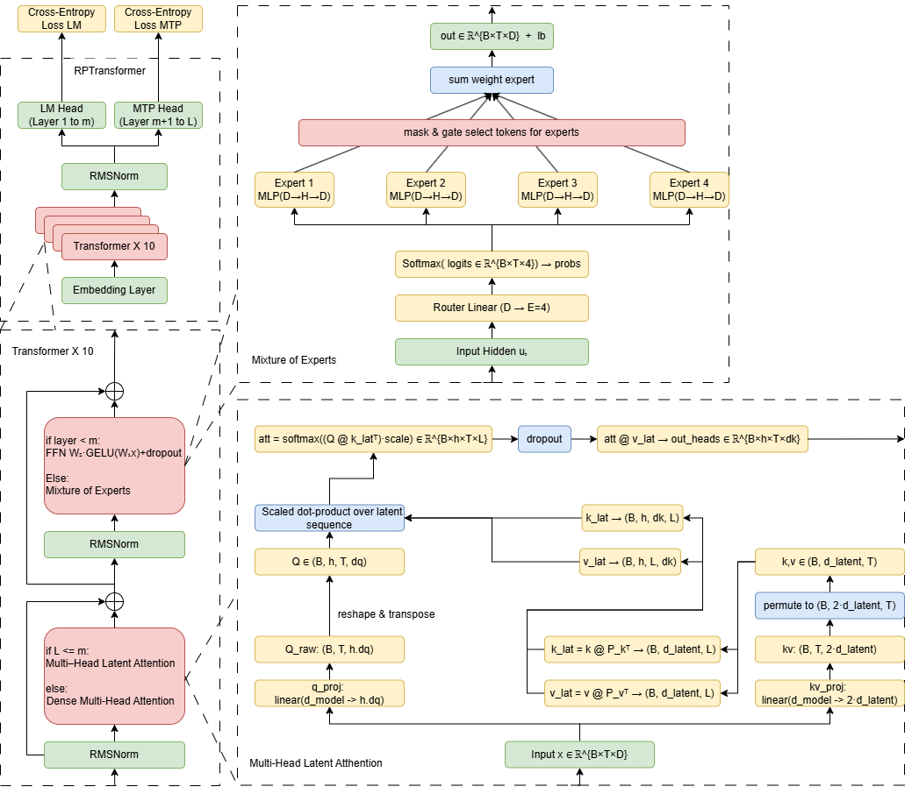

# mini DeepSeek: Compact Transformer with MLA & MoE

---

## Overview

mini DeepSeek is a pedagogical PyTorch implementation of a compact Transformer model designed for efficient language modeling. It integrates two core innovations from DeepSeek-V3:

* **Multi-Head Latent Attention (MLA):** A Linformer-inspired low-rank projection reduces attention complexity from $O(T^2d)$ to $O(TLd)$, cutting FLOPs by \~75% at sequence length 1024.
* **Sparse Mixture-of-Experts (MoE):** A top-2 gating mechanism over four experts, doubling capacity for only 2× compute, with a load-balancing auxiliary loss.

This repository provides the full training pipeline—from data preprocessing to model evaluation—with scripts for experimentation.

---

## Features

* **Model Architecture**

  * 12-layer, pre-norm Transformer.
  * Early layers: MLA + Feed-Forward.
  * Later layers: MLA + MoE.
* **Tokenizer**

  * Byte-level BPE via Hugging Face GPT-2 tokenizer.
  * Full UTF-8 support; preserves whitespace.
* **Scalable Training**

  * Mixed-precision (BF16) on NVIDIA A100 GPUs.
  * Micro-batching with gradient accumulation.
  * AdamW optimizer with cosine-decay learning rate and 1 000-step warm-up.
* **Eval & Metrics**

  * Validation perplexity \~6.3 on Bluemoon Roleplay Chat test split.
  * Peak memory \~18 GB; codebase < 1 000 lines.

---

## Architecture

*Place the architecture diagram here:*

```markdown

```

`RolePlayTransformer` comprises:

* **Embedding:** Byte-level BPE embeddings (│V│=50 257, d=768).
* **Transformer Blocks (12 total):**

  * **Layers 1–5:**

    * RMSNorm → Multi-Head Latent Attention (MLA)
    * RMSNorm → Feed-Forward (2 × Linear + GELU + Dropout)
  * **Layers 6–10:**

    * RMSNorm → MLA
    * RMSNorm → Sparse Mixture-of-Experts (4 experts, top-2 router)
  * **Layers 11–12:**

    * RMSNorm → MLA
    * RMSNorm → Feed-Forward
* **Output Heads:**

  * `lm_head` and `mtp_head` for language modeling and multi-turn prediction.

---

## Performance

* **Dataset:** 261 K messages (3 637 threads); 4-message sliding windows → 176 828 train / 73 396 test examples.
* **Training Setup:** BF16 on NVIDIA A100 (40 GB), micro-batch 8 × gradient accumulation ×4, AdamW (β=(0.9,0.95), wd=0.01), cosine-decay LR with 1 000-step warm-up.
* **Results:**

  * Validation perplexity ≈ 6.3 on 37 M tokens.
  * Peak GPU memory ≈ 18 GB.
  * Codebase < 1 000 lines, enabling rapid iteration.

---

*Zhengyi Chen, May 2025*
