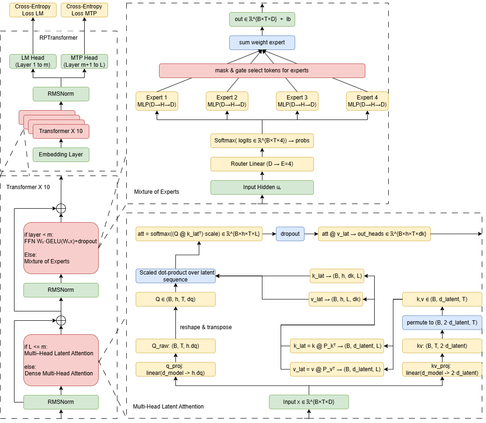

# Mini-DeepSeek: experimental PyTorch language modeling

A learning project exploring Transformer training, sequence-compressed attention and sparse mixture-of-experts routing for dialogue generation.

**Status:** research prototype undergoing a correctness and reproducibility review. The historical project name is Mini-DeepSeek; the attention implementation in the current Python module uses Linformer-style sequence compression and should not be treated as a faithful reproduction of DeepSeek's MLA.

## Start here

| File | Purpose |
| --- | --- |
| [mini_deepseek.py](mini_deepseek.py) | Model components, training and evaluation methods. |
| [chatbot_V1.ipynb](chatbot_V1.ipynb) | Original notebook experiments and data preparation. |
| [markov_baseline.py](markov_baseline.py) | Separate Markov baseline implementation. |
| [mini_deepseek.pdf](mini_deepseek.pdf) | Historical project write-up; read alongside the current-code notes below. |

## Architecture in the current module

- RMSNorm and residual Transformer blocks with learned positional embeddings.
- Learned projections compress keys and values along the sequence axis before attention.
- Four feed-forward experts with top-2 routing in the MoE blocks.
- Tied token-embedding and output weights, with an optional auxiliary prediction head.
- Training support for BF16, gradient accumulation, gradient checkpointing, AdamW and cosine learning-rate scheduling.

The `RolePlayTransformer` constructor currently defaults to **10 layers**, with MoE enabled from zero-based layer index 5 onward. Earlier project documentation described a 12-layer configuration. Specify and save the configuration used for each experiment rather than assuming the notebook and module are identical.



The diagram records the original design; the Python source is the reference for the current implementation.

## Working with the code

The code uses Python, PyTorch, Hugging Face `transformers` and `datasets`. There is no packaged training CLI or pinned environment yet. The training methods expect a preprocessed dataset saved with Hugging Face datasets; inspect their arguments and the notebook before launching a run.

A small model can be instantiated for code exploration after installing compatible dependencies:

```python
from mini_deepseek import RolePlayTransformer

model = RolePlayTransformer(
    vocab=256,
    max_len=64,
    d_model=128,
    n_layers=2,
    n_heads=2,
    d_ff=256,
    moe_start=1,
    use_mtp=False,
    gradient_checkpointing=False,
)
```

This is an inspection example, not a validated training recipe or a reproduced benchmark.

## Evaluation status

Earlier documentation reported perplexity, memory usage and compute savings. Those values are not presented here as verified benchmarks: reproducible configurations, checkpoints and benchmark logs must accompany any future performance claim.

The current implementation needs particular attention in two areas:

1. **Causal masking after sequence compression.** Keys and values are mixed across positions before masking; tests are needed to ensure future tokens cannot influence earlier predictions.
2. **Router auxiliary-loss gradients.** The current load-balancing calculation receives detached probabilities and masks, so that term does not train the router. A corrected objective needs gradient checks and a new training run.

## Next experiments

- Add causal-invariance, padding and router-gradient tests.
- Establish a standard causal-attention baseline before comparing compression or MoE variants.
- Fix a conversation-level data split before creating overlapping dialogue windows.
- Record configuration, seed, software versions, dataset provenance and checkpoint identifiers.
- Compare validation loss, generation examples, throughput and peak memory under matched settings.

These are planned tasks, not completed results.
