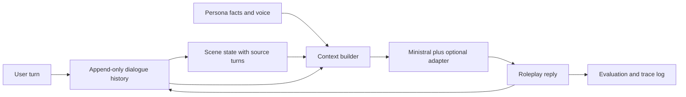

# Roleplay research and implementation plan

## Latest result: generic response rule does not pass refinement gates

Fresh bilingual scenes and voice/coverage review are now complete in
`RESPONSE_REFINEMENT_RESULTS.md`. Adding one bundled first-person/completeness/
premise-correction sentence improves fresh semantic passes 10 -> 14/36 but
regresses familiar passes 41 -> 39/48. Familiar voice errors improve 6 -> 2;
omissions worsen 7 -> 8 and one role error appears. Fresh role errors stay at five
under both arms. No default promotion, training or advanced optimizer follows.
All 48 familiar baseline outputs reproduce; historical ratings stay frozen.

Next priority is a narrow diagnostic of stale current-state handling: freeze new
authored EN/FR handoff scenes and compare obsolete history present versus absent
while preserving current state, model and decoding. This is a diagnostic ablation,
not a production history-removal proposal, and has not started. If needed afterward,
scope bilingual state-update/coverage supervision with disjoint scene families.
The current 84 requests are development diagnostics and must not become claims of
independent final testing. Older proposed next steps below are historical.

## Latest result: natural references are a promising experimental candidate

Primary papers were reviewed before running the requested natural-sentence
ablation; see `NATURAL_REFERENCE_RESEARCH.md`. With the same CSFT checkpoint,
48 matched development requests produced 13 -> 0 explicit role errors and
30 -> 41 all-constraint passes. Omissions rose 4 -> 7; both language-specific
gates fail, so no default promotion. 12 requests were byte-identical controls;
on the 36 changed requests passes improved 18 -> 29. Historical per-text ratings
were frozen and reused to prevent review drift. See `NATURAL_REFERENCE_RESULTS.md`.
Next priority is new authored bilingual scenes and coverage/voice validation,
not an advanced loss. No new follow-up or training has started. Third-person
state copying remains a limitation even when entity attribution is correct.

## Latest result: entity-assignment state is not ready for adoption

The controlled state-format experiment reduced role errors 13 -> 6 but increased
omissions 4 -> 17 on the same 48 development requests and unchanged CSFT checkpoint.
All-constraint passes fell 30 -> 24. Both languages failed the frozen gate.
See `STATE_FORMAT_RESULTS.md` for the full non-independent assistant review and
`STATE_FORMAT_PROTOCOL.md` for controls/limitations. No default or training change.
Next candidate: preserve natural sentence structure/order while replacing ambiguous
second-person references only. This follow-up is not started; first preserve the
negative assignment-format result, then freeze a new comparison and validate on
fresh authored scenes if promising. Advanced losses remain deferred.

## Latest implementation: bilingual preferences and the simpler control

The user authorized the prerequisite work below. V2 expands the training scene
families from 16 to 40 while removing repeated aliases, with one pair per language
and scene. It includes 24 assistant-reviewed natural S1 errors in training; all
other negatives remain authored contrasts. Validation and new evaluation scenes
are separately partitioned. This is still assistant-curated, not independently
human-labeled data. See `BILINGUAL_CONTROL_PROTOCOL.md` and
`BILINGUAL_CONTROL_RESULTS.md`. Both trained arms use the same S1 initialization,
chosen examples and 20 updates; DPO additionally processes rejected replies, so
compute is measured rather than claimed equal. No advanced optimizer is added.

Completed result: CSFT beats DPO 7 to 1 with 40 ties on 48 new matched requests;
all-constraint pass counts S1/CSFT/DPO are 25/29/24. These are single-assistant
judgments on eight scene families. Overall contradictions remain 15 for CSFT
versus S1 and rise to 20 for DPO; CSFT has one additional English contradiction.
Do not promote by average alone. Next targeted hypothesis: second-person prose in
state encourages role-copying; compare explicit character/user entity wording as
a separately frozen prompting experiment. Human review and richer scene coverage
remain pending; advanced optimization remains unjustified by this pilot.

## Latest decision: advanced training is not yet justified

The user conditionally requested one advanced method. After reviewing the D1
evidence and Se-DPO method, defer advanced training. Contradictions remain 27/174,
French regresses from 18 to 21, and the curriculum has only 16 training templates.
No matched continued-SFT control or independent review is available. Se-DPO is
the sole retained candidate, subject to stronger evidence; no distillation/RL or
automatic training job was added. See `ADVANCED_METHOD_DECISION.md` for the
reasoning and conditions for reconsideration. Improve ordinary controls first.

## Latest update: authorized standard DPO comparison

The user requested standard DPO versus SFT under identical evaluation conditions
and permits generated-output review for this comparison. The older no-review and
wait-for-DPO gates below are superseded within this scope. Raw source dialogue
remains private. The D1 pilot uses the exact S1 checkpoint as initialization and
frozen reference, with a separately authored synthetic preference curriculum.
See `DPO_COMPARISON.md` for evidence and next steps; `DPO_COMPARISON_PROTOCOL.md`
was fixed before training/output review. Do not infer human preference from the
assistant's annotations or treat correlated template variants as independent data.

Observed: DPO 27 wins / 67 ties / 14 losses, fewer omissions but unchanged total
required-fact contradictions and a French contradiction regression. Next priority
is varied, user-reviewed natural error pairs and new held-out bilingual scenario
families. A future objective ablation needs matched continued SFT on chosen replies;
this pilot only compares SFT with SFT plus additional preference training. Add
independent rollouts and training seeds before promotion; RL remains gated.

## September 24: user-authorized S1 structural pilot

The user has now explicitly authorized LoRA training on randomly ordered complete
source conversations. This supersedes the earlier wait-for-review gate for this
pilot. It does not authorize assistant review of dialogue. Structural filters
produce 116 train / 17 validation whole threads within 2,048 native tokens,
preserving historical splits and excluding truncated/ambiguous examples.
This is a small dialogue-adaptation pilot, not semantically curated state SFT.
No persona/state labels were invented; no language or output-quality claims are
made. P1 remains the authored-state inference wrapper. See `LORA_TRAINING.md`.
Decisions about broader SFT, DPO or RL still need the user's own output judgments.

## September 24 execution update: P1 and user-only output review

The user has requested explicit persona and scene state and prohibited assistant
review of dialogue/model outputs. P1 now implements an authored ledger with
turn-indexed scene changes, stable identity, unknown/claim distinction, source
provenance and native-token-budgeted context. See `PERSONA_SCENE_STATE.md`.
P0 weights/decoding remain fixed; P1 is a separately named prompting experiment.
No automatic state extraction, fine-tuning or RL is performed by this change.

All subsequent model-output judgments belong to the user. The coding assistant
must not open generated galleries/transcripts or run content-scoring/AI-review
pipelines. Earlier proposed AI-review steps below are superseded. Verify code
using benign synthetic fixtures and record technical metrics only. Supply paths
to locally saved replies; wait for the user's judgments before choosing later
SFT/DPO work on the basis of output quality. This implementation alone is not
evidence of better coherence, language adherence or scene consistency.

Revised September 23, 2026. Proposed work, informed by the completed local run
and [the literature review](LITERATURE_REVIEW.md). No pretrained model or adapter
had been downloaded or trained when this plan was written.

**September 24 update:** P0 inference and the bilingual development panel are
complete; see [MINISTRAL_EVALUATION.md](MINISTRAL_EVALUATION.md). The model is now
cached locally, with no adapter training. The first-turn quality gate fails
(39/60 acceptable for both coherence and relevance), despite healthy runtime.
Investigate prompt/state controls and French factuality before starting SFT.

## Decision

Build a persona-consistent chatbot using a pretrained Ministral model, explicit
scene state, curated supervised fine-tuning (SFT), and then standard direct
preference optimization (DPO). Test one advanced method only after those controls
work. Preserve the custom decoder as a completed educational experiment.

The research question is: **How much does explicit state reduce character and
scene contradictions, and what does preference training add at a measured
single-GPU cost?** The optional extension asks whether token-aware training adds
value beyond ordinary DPO. A useful negative result is a valid outcome.

The former plan made Se-DPO mandatory and postponed memory. That order did not
match our evidence. The principal failures are losing the scene, changing
characters, and occasionally producing gibberish; low repetition alone is not
success. More decoder layers or a new attention mechanism is not the next step.

## Evidence and preserved controls

`modern-rope-swiglu-v1` completed four epochs with 123,551,232 parameters and
validation perplexity 38.10. In the fixed 150-reply validation panel, mean repeated
word 4-gram fraction was 0.41%, but an AI review of 20 replies rated relevance
2.05/5 and coherence 1.95/5. Only 3/20 met both >=3. The historical inn-door prompt
produced gibberish in all three seeds. These are not independent human ratings.
See [GENERATION_EVALUATION.md](GENERATION_EVALUATION.md).

Keep architecture v2, the completed v3 run, tokenizer fingerprints, exact EOS
boundaries, causal masks, reply-only loss, and thread splits intact. The old
Colab checkpoint is unavailable locally; no matched improvement over it has been
demonstrated. Historical pre-correction perplexity near 6.3 is invalid.

Before another scratch run, spend at most one investigation session on:

1. A fixed validation panel spanning short, medium, and long contexts; compare
   the same scene with and without older history, marking facts removed.
2. First-reply-token NLL, entropy, and top predictions across available saved
   checkpoints; inspect target boundaries and supervision coverage by length.
3. Neutral character aliases and simple scene prompts to separate surface-name
   dependence from context use. Log token loops as well as word repetition.

The checked tokenizer round-trip and CPU/GPU logits already agree closely; the
root cause remains unproven. Do not repeat those checks without new evidence.
If a concrete defect emerges, fix it in a named experiment. If not, retain the
failure report and move to pretrained inference rather than extending epochs.

## Architecture of the next system

Use the previously selected
[Ministral-3-3B-Instruct-2512-BF16](https://huggingface.co/mistralai/Ministral-3-3B-Instruct-2512-BF16).
The official card identifies a 3.4B language component and 0.4B vision encoder,
with Apache 2.0 licensing. Start with text inputs and frozen vision components;
pin the revision, native processor, chat template, and supported loader. Verify
actual loaded modules and memory rather than assuming a text-only loader.

- **Persona:** stable role ID, display name, relationships, knowledge boundaries,
  motivations, and a short voice description. User-authored edits are explicit.
- **Scene state:** location, present characters, possessions, established events,
  and unresolved actions. Each fact has a source turn, entity ID, and status.
  Unknown information stays unknown. A character's claim is not automatically
  world truth; conflicting claims retain their attribution.
- **Context builder:** native conversation formatting; persona, relevant state,
  and recent turns within a recorded token budget. Drop older narrative before
  essential identity constraints; log every truncation. No future-turn access.
- **Memory update:** initially use authored fixtures as a diagnostic control.
  Then evaluate a separate extraction step using only observed turns. Reject
  unsupported updates and protect user agency. Store editable structured facts
  and provenance rather than hidden reasoning text.

This is a project design hypothesis inspired by
[PsyMem](https://aclanthology.org/2026.tacl-1.24/), not a reproduction of its graph
and psychological architecture. Begin with a small structured ledger; add vector
retrieval only when measured histories outgrow it. Test noisy and stale facts.
Do not silently rewrite failed replies during the core comparisons.

## Experiments and attribution

| ID | Model and context | Question / comparison |
| --- | --- | --- |
| H0 | Completed custom decoder | Historical educational reference only |
| P0 | Frozen Ministral, persona + recent history | Does pretrained inference solve basic fluency? |
| P1 | Exact P0 weights + authored current-state ledger | Does explicit, correct state help? |
| P2 | Exact P0 weights + automatically maintained ledger | What does state extraction cost in quality and latency? |
| S1 | LoRA SFT + same context pipeline | Does curated adaptation improve over frozen weights? |
| D1 | Exact S1 checkpoint + ordinary DPO | Does preference training improve over SFT? |
| T1, optional | Exact S1 checkpoint + Se-DPO | Does token credit improve over D1? |
| T0, optional | Exact S1 checkpoint + fixed-credit ablation | Does evolving credit matter? |

Run P0/P1/P2 on identical scenarios and generation seeds. P1's authored ledger
contains only facts available at that turn; it is a diagnostic upper control,
not a deployable result. Select and freeze the context pipeline on validation.
For S1 versus frozen weights, rerun the frozen control with precisely that pipeline.
For D1/T1/T0, hold data, reference checkpoint, template, adapter modules, sequence
budget, decoding, and context pipeline fixed. Report token budgets and wall time;
do not conflate a state improvement with an optimizer improvement.

Start with one seed for feasibility, then use three training seeds for the main
preference comparison if the pilot supports the cost. Give each method the same
validation search budget. Log the hyperparameter search, not just the winner.
Do not compare perplexity across the GPT-2 and Ministral tokenizers.

## Data and evaluation first

Create 20 development scenarios before training: 10 English and 10 French,
covering unfamiliar characters, misleading premises, location changes, objects,
relationships, user agency, short openings, and 5-10-turn continuity. Include
paired aliases of all relevant names and invented personas. Famous-character
knowledge must not substitute for following supplied facts; see the
[2026 anonymous roleplay evaluation study](https://aclanthology.org/2026.sigdial-1.15/).

Separately reserve a target of 200 final scenarios, balanced across languages and
failure categories. Keep persona/scene families, paraphrases, translations, and
aliases in a single partition. Use validation for all iteration; the existing
test split and the new locked test remain untouched until method selection.
The 20-scenario development panel is a smoke gate, not statistical evidence.

Pilot data targets: 500-1,000 audited SFT examples and about 200 preference pairs.
Scale toward 5,000-10,000 SFT examples and 2,000-5,000 pairs only if quality and
throughput justify it. These are scope limits, not sample-complexity guarantees.

Each record needs source/license, thread/persona/scene IDs, available facts,
history, language, response, and construction method. Split before augmentation
and detect semantic duplicates. Never extract persona facts from a target reply
or future turn. Keep prepared private conversations outside Git.

Audit independently for relevance, continuity, fluency, persona fidelity, and
diversity. Do not collapse these into an unexplained scalar. This adapts the
multi-axis curation principle of
[Edu-QuRating](https://arxiv.org/abs/2609.09425), not its educational scoring model.
Existing Bluemoon replies are candidates, not automatically preferred answers.
Use natural model mistakes plus varied controlled edits for preferences; avoid
length, punctuation, or stock-phrase shortcuts. Include short conversational
openings and uncertainty when information is absent. Keep helpful generic chat
examples as a measured retention mixture; choose the ratio on validation.

Primary endpoint: violated applicable fact opportunities / all applicable fact
opportunities, with a frozen rubric and separately reported omissions. Also
report the percentage of turns with any contradiction. Empty replies must fail
response quality rather than receive credit for avoiding contradictions.

Secondary measures: blinded win/tie/loss, coherence, relevance, grammar, persona
voice, user-agency violations, character swaps, scene drift, gibberish, repeated
subword runs, word 4-grams, output length, EOS/cap rates, and distinct outputs.
Measure latency, throughput, GPU hours, and allocated/reserved/device-wide VRAM.
Track whether each required fact was actually in the provided context.

Use randomized output order and audit length/position bias in automated judging.
Label AI ratings as AI ratings; obtain a blinded human subset, including a fluent
French reviewer. Bootstrap by scenario family, not individual turn. Publish
uncertainty and failure examples, including negative results.

## Training order and gates

These thresholds are provisional engineering targets, not paper-derived
guarantees. Freeze them before inspecting each new comparison.

1. **Inference and formatting:** P0 on 20 scenarios x three generation seeds;
   no malformed/empty/gibberish outputs, >=90% rated grammar >=3/5 and >=80%
   rated relevance and coherence >=3/5. If it fails, investigate loader/template,
   truncation, prompts, and backbone suitability before producing training data.
2. **State baseline:** compare P0/P1/P2. If P1 helps but P2 does not, repair the
   extractor. If correct state does not help, inspect how the model uses it.
   Save all state snapshots, sources, prompts, and latency measurements.
3. **SFT pilot:** assistant-response loss with native boundaries, frozen backbone,
   and LoRA. Test tiny-set learning, causal/padding isolation, masked tokens,
   finite FP16 gradients, and save/resume/reload before scaling. Select by
   validation reply quality, not training loss alone.
4. **DPO pilot:** immutable S1 reference, auditable chosen/rejected pairs, cached
   reference log probabilities where appropriate, and beta/LR search on validation.
   Confirm reference freezing, loss/gradient calculations, masks, and adapter
   selection. Turning off the policy adapter does not recover an SFT reference
   if S1 itself is an adapter; retain the exact frozen S1 adapter separately.
5. **Advance only on useful gains:** target >=20% relative reduction in fact
   violations against the matched control, with <=5 percentage-point drop in
   acceptable coherence/relevance and no new gibberish. Report absolute counts
   and intervals; tiny or zero control error makes a relative target uninformative.
   An inconclusive pilot permits collecting more validation evidence, not a claim
   of success. Confirm the selected result on the locked test only once.

Choose one advanced branch after D1, based on the remaining failure:

- **Se-DPO:** first choice if fluent replies still contain localized factual
  errors. Its credits use policy/reference signals and reference entropy. The
  paper's weighted objective is an approximation; resolve gradient flow against
  the paper/author implementation before coding. Verify uniform credits recover
  DPO, and compare a fixed-credit ablation. Cache exact-token reference statistics
  with revision/template/mask hashes; compute entropy in chunks.
  [Paper](https://arxiv.org/html/2608.09568v1).
- **On-policy context distillation:** alternative if richer scaffolding reliably
  fixes replies but adds unacceptable latency/context overhead. Compare against
  ordinary teacher-output SFT and the uncompressed teacher. Preserve dynamic
  persona and scene facts at inference; distill general behavior, not held-out
  character knowledge. On-policy rollouts require refreshed teacher scoring and
  a separate cost profile. This roleplay application remains a hypothesis.
  [Paper](https://arxiv.org/html/2602.12275v1).
- **Verifiable RL:** later, only if residual constraints have reliable rewards.
  Use fact-grounded hints as inspiration from
  [VeriRole](https://proceedings.iclr.cc/paper_files/paper/2026/file/12df08e9280061b4877f97598c644c3e-Paper-Conference.pdf).
  Audit rewards on held-out validation cases, including copied hints followed by
  contradictory replies, empty answers, evasions, and verbosity. Require >=90%
  precision and recall for the defined violation detector on an independently
  annotated audit set, with uncertainty reported. Use creative quality as an
  independent guardrail. Profile rollout, reference, and optimization memory
  before deciding whether a small GRPO pilot fits. No RL launch is scheduled.

Do not stack all three methods into the first study. If DPO does not improve,
inspect preference quality and the error taxonomy before adding complexity.

## RX 7900 XTX execution budget

Primary hardware is the user's 24GB RX 7900 XTX under validated WSL2 ROCm.
The existing custom FP16 trainer works; Ministral/PEFT, BF16 training, and 4-bit
adapter training have not been validated here. Use a separate environment and
lockfile so the working custom-model environment remains reproducible.

Start profiling unquantized frozen weights with FP16 LoRA compute, rank 16,
language attention projections, sequence length 1,024, micro-batch 1, gradient
checkpointing, and gradient accumulation. Keep adapter/optimizer numerics in
supported stable precision. Verify module names and dtype handling explicitly.
Try length 2,048 only after maximum-length backward and optimizer steps pass.
All compared adapter methods must use identical trainable modules.

Use QLoRA as a measured memory alternative if necessary. Current
[bitsandbytes documentation](https://huggingface.co/docs/bitsandbytes/main/en/installation)
lists ROCm support including gfx1100, but that is not validation of this exact
WSL/PyTorch/model combination. Pin compatible packages and test NF4 forward,
backward, optimizer, and reload. Do not replace the source checkpoint with the
FP8 distribution or install CUDA requirements on AMD. BF16 is a separate preflight.

Provisional memory target: **at most 18 GiB PyTorch reserved**, and enough
device-wide free memory for a **4 GiB desktop/driver margin** under normal desktop
load. Lower the process budget if measured outside-process use requires it.
These are conservative working targets, not a measured safe maximum or a fresh
free-VRAM reading. Include temporary peaks, reference scoring, and generation;
PyTorch reservation alone does not describe total board usage.

Budget a 30-60-minute feasibility session before each new training method. Measure
representative maximum-length batches, validation, reference-cache construction,
and checkpoint writes. For DPO, profile both responses and correct S1 reference
handling; for distillation/RL, include generation and teacher/reward costs.

Each subsequent overnight run has the user's **six-hour wall-clock budget**.
Schedule checkpoints early enough to leave measured save/validation overhead;
stop launching training work around 5.5 hours initially and use a resumable soft
limit. A soft limit may overrun by an in-flight step/save; report actual duration.
Project time from this model's measured tokens/sec, never from the 123M model's
40 examples/sec. Hold comparison token budgets fixed across resumed sessions.

Visible terminal and file logs must include stage, progress, target tokens, loss,
LR, gradient/scaler status, throughput, elapsed time/ETA, allocated/reserved VRAM,
and checkpoint path. Record host/device memory and power when available. Estimate
electricity from measured whole-system average kW x hours x the user's tariff;
GPU nominal power alone is not a household cost measurement.

No paid compute, external teacher calls, or further training is part of this
planning revision. Consider a larger GPU only after a measured blocker and a
cost estimate, preserving the experiment rather than silently changing it.

## Pretraining track and deliverables

Keep further scratch pretraining optional. Four passes over overlapping windows
do not supply four times as much unique language. The prepared training set has
about 24.57M supervised reply tokens per pass; context tokens are not all direct
loss targets. This accounting does not prove the cause of the short-prompt failure.

If revisiting pretraining, name a separate experiment comparing broader licensed
text plus domain data, then reply-only SFT, against a matched budget control.
Full-token pretraining changes the objective and must not be a baseline resume.
Tune repetition on domain validation rather than copying a universal epoch count;
[recent repetition research](https://arxiv.org/abs/2608.14071) studies a materially
different mixture and token budget. Do not add MoE, compressed attention, or a new
tokenizer without a specific hypothesis and independent evaluation.

Implement new work under `posttraining/`: data schemas/manifests, native-template
inference, state tracking, evaluation, SFT/DPO, AMD launcher, and versioned configs.
These are proposed modules, not existing commands. Add synthetic correctness tests
for behavioral changes and run the project's full unittest suite plus affected
Ruff checks. Keep private raw outputs local; publish aggregate reports and
permission-cleared examples, a model/data card, and a reproducible persona-chat demo.

Immediate implementation milestone: the P0/P1/P2 evaluation harness and the
Ministral inference/memory preflight. Finish that comparison before selecting
the first adapter-training run.
